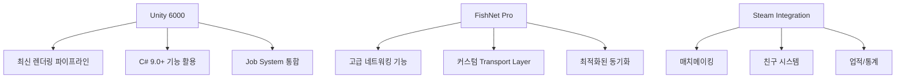
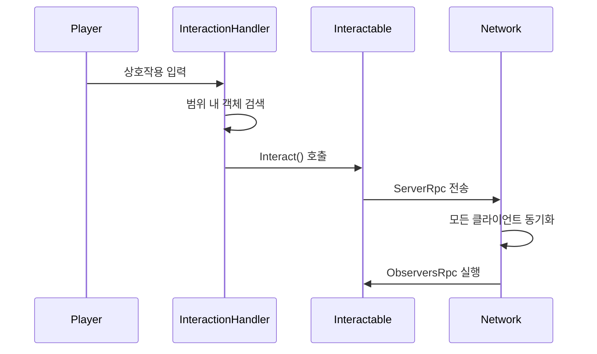
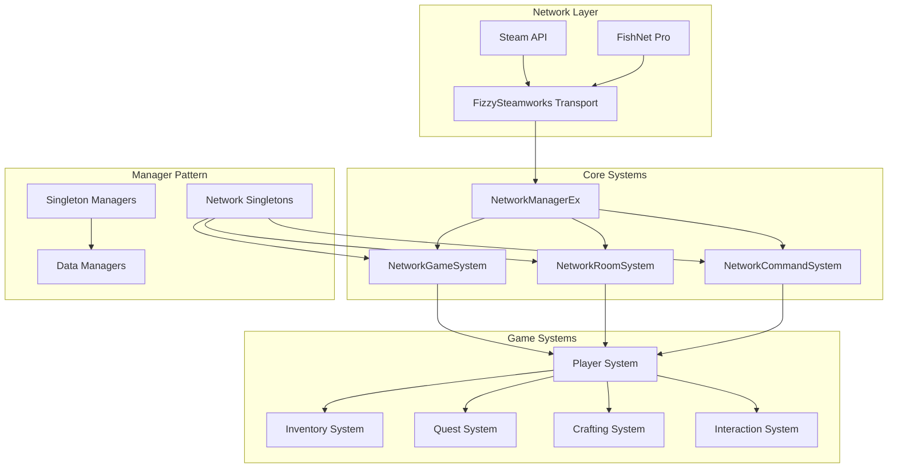
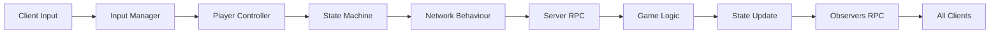
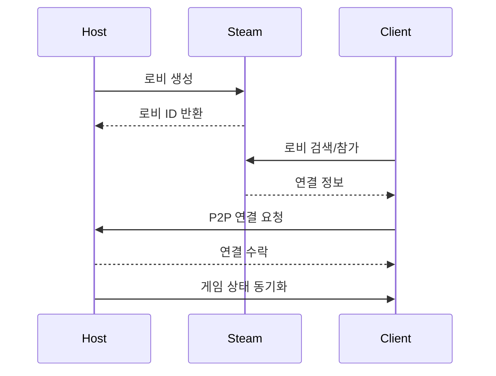

# 🎮 PROJECT_MS: 차세대 멀티플레이어 서바이벌 게임

<p align="center">
  
  
  
  
</p>

## 📋 목차

1. [프로젝트 개요](#-프로젝트-개요)
2. [핵심 게임플레이 시스템](#-핵심-게임플레이-시스템)
3. [기술 아키텍처](#-기술-아키텍처)
4. [네트워크 시스템](#-네트워크-시스템)
5. [설치 및 실행](#-설치-및-실행)
6. [개발 가이드](#-개발-가이드)
7. [API 문서](#-api-문서)
8. [성능 최적화](#-성능-최적화)
9. [배포 가이드](#-배포-가이드)
10. [문제 해결](#-문제-해결)

---

## 🎯 프로젝트 개요

### 게임 소개

PROJECT_MS는 **Unity 6000**과 **FishNet Pro** 네트워킹 프레임워크를 기반으로 개발된 차세대 **비대칭 멀티플레이어 서바이벌 게임**입니다. 플레이어는 **Survival(생존자)** 또는 **Imposter(사칭자)** 역할을 맡아 긴장감 넘치는 심리전과 전략적 게임플레이를 경험합니다.

### 핵심 특징

#### 🎭 비대칭 게임플레이
- **역할 기반 시스템**: 무작위로 배정되는 Survival/Imposter 역할
- **승리 조건 차별화**: 
  - Survival: 제한 시간 동안 생존 및 퀘스트 완료
  - Imposter: 모든 Survival 제거

#### 🌐 최첨단 멀티플레이어
- **Steam P2P/Dedicated Server** 하이브리드 네트워킹
- **실시간 상태 동기화**: 플레이어 위치, 인벤토리, 게임 상태
- **낮은 지연시간**: FishNet의 예측/보간 시스템 활용
- **자동 매치메이킹**: Steam 로비 시스템 통합

#### 🎨 몰입형 게임 경험
- **Universal Render Pipeline (URP)** 기반 고품질 그래픽
- **Cinemachine** 카메라 시스템으로 부드러운 시점 전환
- **실시간 조명 및 그림자**: 분위기 있는 환경 연출

<details>
<summary>🔧 기술적 혁신 다이어그램</summary>



</details>

---

## 🎮 핵심 게임플레이 시스템

### 📦 인벤토리 시스템

#### 아키텍처 개요
- **메인 인벤토리**: 10 슬롯
- **퀵슬롯**: 5 슬롯  
- **장비 슬롯**: 타입별 분류
- **실시간 네트워크 동기화**

<details>
<summary>📋 인벤토리 코드 구조</summary>

```csharp
public class Inventory
{
    public Storage ItemStorage { get; private set; }      // 메인 인벤토리 (10 슬롯)
    public Storage QuickSlotStorage { get; private set; } // 퀵슬롯 (5 슬롯)
    public EquipStorage EquipStorage { get; private set; } // 장비 슬롯
}
```

#### 주요 기능

1. **계층적 저장소 구조**
   - `Storage`: 기본 저장소 클래스
   - `ItemSlot`: 개별 아이템 슬롯 관리
   - `InventoryDataHandler`: 전역 아이템 추적

2. **네트워크 동기화**
   ```csharp
   [ServerRpc]
   private void AsyncItemSlot(int slotIdx, int itemId, int amount, int durability)
   {
       ObserversRpcItemSlot(slotIdx, itemId, amount, durability);
   }
   ```

3. **스마트 아이템 관리**
   - 자동 스택 관리
   - 내구도 시스템
   - 아이템 타입별 제약사항

</details>

<details>
<summary>⚡ 성능 최적화 기법</summary>

- **이벤트 기반 업데이트**: 변경 시에만 UI 갱신
- **참조 카운팅**: 메모리 효율적인 아이템 관리
- **배치 동기화**: 네트워크 트래픽 최소화

</details>

### 🤝 상호작용 시스템

#### 핵심 기능
- **거리 기반 우선순위 정렬**
- **인벤토리 공간 자동 체크**
- **실시간 네트워크 동기화**

<details>
<summary>🔧 상호작용 코드 구조</summary>

```csharp
public class InteractionHandler : MonoBehaviour
{
    private HashSet<Interactable> interactables = new HashSet<Interactable>();
    
    public Interactable GetInteractObject(bool Remove = false)
    {
        // 거리 기반 우선순위 정렬
        // 인벤토리 공간 체크
        // 아이템 타입별 상호작용 가능 여부 확인
    }
}
```

</details>

<details>
<summary>📋 상호작용 가능 객체</summary>

| 객체 타입 | 설명 | 네트워크 동기화 |
|----------|------|-----------------|
| `StorageBox` | 공유 저장소 | ✅ 실시간 동기화 |
| `CraftingTable` | 제작대 | ✅ 제작 과정 동기화 |
| `QuestStorageBox` | 퀘스트 아이템 보관함 | ✅ 진행도 공유 |
| `ItemObject` | 드롭된 아이템 | ✅ 픽업 즉시 동기화 |

</details>

<details>
<summary>🔄 상호작용 흐름도</summary>



</details>

### 📋 퀘스트 시스템

#### 퀘스트 카테고리
1. **수집 퀘스트**: 특정 아이템 수집
2. **제작 퀘스트**: 아이템 제작
3. **상호작용 퀘스트**: 특정 객체와 상호작용
4. **전투 퀘스트**: 적 처치

<details>
<summary>📋 퀘스트 구조 코드</summary>

```csharp
public class Quest
{
    public QuestData QuestData { get; private set; }
    public List<Task> Tasks { get; private set; }
    public event Action<Quest> onCompleted;
}
```

#### 진행 추적 시스템
```csharp
public void ReceiveReport(ETaskCategory category, int targetId, int successCount = 1)
{
    foreach (var quest in activeQuests.ToArray())
        quest.RecieveReport(category, targetId, successCount);
}
```

</details>

### 🔨 제작 시스템

#### 핵심 기능
- **레시피 기반 제작** (최대 3개 재료 조합)
- **실시간 재료 검증**
- **네트워크 동기화**

<details>
<summary>🔧 제작 시스템 코드</summary>

```csharp
public class CraftingItemData : ItemData
{
    public Storage requiredStorage { get; private set; } = new Storage(3);
    // 최대 3개의 재료 조합 지원
}
```

#### 제작 프로세스

1. **재료 검증**
   - 실시간 재료 보유량 체크
   - UI에 제작 가능 여부 표시

2. **제작 실행**
   ```csharp
   private void MakeItem(CraftingItemData data)
   {
       // 재료 소모
       // 결과물 생성
       // 퀘스트 진행도 업데이트
       // 분석 데이터 전송
   }
   ```

3. **네트워크 동기화**
   - 제작 시작/완료 이벤트 전파
   - 인벤토리 상태 즉시 반영

</details>

---

## 🏗️ 기술 아키텍처

<details>
<summary>🏛️ 시스템 아키텍처 다이어그램</summary>



</details>

### 핵심 설계 패턴

<details>
<summary>🔧 Singleton 패턴</summary>

```csharp
public class Singleton<T> : MonoBehaviour where T : MonoBehaviour
{
    private static T _instance;
    public static T Instance 
    { 
        get 
        {
            if (_instance == null)
            {
                _instance = FindObjectOfType<T>();
                if (_instance == null)
                {
                    GameObject singleton = new GameObject(typeof(T).Name);
                    _instance = singleton.AddComponent<T>();
                }
            }
            return _instance;
        }
    }
}
```

</details>

<details>
<summary>🌐 NetworkSingleton 패턴</summary>

```csharp
public class NetworkSingleton<T> : NetworkBehaviour where T : NetworkBehaviour
{
    public static T Instance { get; private set; }
    
    public override void OnStartNetwork()
    {
        if (Instance != null && Instance != this)
        {
            Destroy(gameObject);
            return;
        }
        Instance = this as T;
    }
}
```

</details>

<details>
<summary>🎮 State Machine 패턴</summary>

```csharp
public class AlivePlayerStateMachine
{
    public AlivePlayerMovementStateMachine MovementStateMachine { get; }
    public AlivePlayerCombatStateMachine CombatStateMachine { get; }
    
    // 계층적 상태 관리로 복잡한 플레이어 행동 제어
}
```

</details>

<details>
<summary>📊 데이터 플로우</summary>



</details>

---

## 🌐 네트워크 시스템

### FishNet Pro 통합

#### 주요 기능
- **NetworkObject 자동 동기화**
- **SyncVar 실시간 변수 동기화**
- **RPC 원격 프로시저 호출**

<details>
<summary>🔧 네트워크 동기화 전략</summary>

1. **NetworkObject 관리**
   ```csharp
   [RequireComponent(typeof(NetworkObject))]
   public class AlivePlayer : NetworkBehaviour, IDamageable
   {
       // 자동 동기화되는 플레이어 엔티티
   }
   ```

2. **SyncVar 활용**
   ```csharp
   public readonly SyncVar<GameOptions> GameOptions = new SyncVar<GameOptions>();
   public readonly SyncDictionary<NetworkConnection, PlayerInfo> Players = new SyncDictionary<>();
   ```

3. **RPC 패턴**
   - `[ServerRpc]`: 클라이언트 → 서버
   - `[ObserversRpc]`: 서버 → 모든 관찰자
   - `[TargetRpc]`: 서버 → 특정 클라이언트

</details>

### Steam 네트워킹 통합

<details>
<summary>🎮 로비 시스템</summary>

```csharp
public class NetworkRoomSystem : NetworkSingleton<NetworkRoomSystem>
{
    public readonly SyncDictionary<NetworkConnection, ColorType> PlayerColors;
    public readonly SyncDictionary<NetworkConnection, ulong> NetworkConnectionToSteamId;
    
    // Steam 로비 생성/참가/검색 기능
    // 자동 매치메이킹
    // 친구 초대 시스템
}
```

</details>

<details>
<summary>🔄 P2P 연결 관리</summary>



</details>

<details>
<summary>⚡ 네트워크 최적화 기법</summary>

1. **Interest Management**
   - 거리 기반 업데이트 빈도 조절
   - 시야 밖 객체 동기화 최소화

2. **Delta Compression**
   - 변경된 데이터만 전송
   - 대역폭 사용량 최소화

3. **Object Pooling**
   - NetworkObject 재사용
   - 생성/파괴 오버헤드 감소

</details>

---

## 🚀 설치 및 실행

### 시스템 요구사항

| 구분 | 최소 사양 | 권장 사양 |
|------|----------|----------|
| **OS** | Windows 10 64-bit | Windows 11 64-bit |
| **CPU** | Intel i5-8400 | Intel i7-10700 |
| **RAM** | 8GB | 16GB |
| **GPU** | GTX 1060 6GB | RTX 3060 |
| **DirectX** | Version 11 | Version 12 |
| **Storage** | 10GB | 20GB SSD |
| **Network** | 광대역 인터넷 | 광대역 인터넷 |

### 빠른 시작 가이드

#### 🎮 싱글플레이어 테스트

1. `Assets/1. Scene/Title.unity` 열기
2. Play 버튼 클릭
3. "Single Player" 선택

#### 🌐 멀티플레이어 테스트

1. **호스트 시작**
   - "Create Room" 클릭
   - 로비 설정 후 "Start"

2. **클라이언트 참가**
   - "Join Room" 클릭
   - 로비 목록에서 선택 또는 코드 입력

<details>
<summary>🔧 개발 환경 설정 상세</summary>

#### 1. 필수 소프트웨어 설치

```bash
# Unity Hub 설치 후
Unity 6000.0.47f1 설치

# Visual Studio 2022 설치 시 필수 구성 요소
- .NET desktop development
- Game development with Unity
- .NET Core cross-platform development
```

#### 2. 프로젝트 클론 및 설정

```bash
# 저장소 클론
git clone [repository-url]
cd PROJECT_MS

# Git LFS 초기화 (대용량 에셋 관리)
git lfs install
git lfs pull
```

#### 3. Unity 프로젝트 설정

1. **Unity Hub에서 프로젝트 열기**
   - "Add" → 프로젝트 폴더 선택
   - Unity 6000.0.47f1 버전 선택

2. **필수 패키지 확인**
   ```
   Window > Package Manager
   - FishNet Pro (임포트 확인)
   - Addressables 2.4.3
   - Universal RP 17.0.4
   - Cinemachine 3.1.3
   - Input System 1.14.0
   ```

3. **Addressables 빌드**
   ```
   Window > Asset Management > Addressables > Groups
   Build > New Build > Default Build Script
   ```

4. **Steam 설정**
   - Steam 클라이언트 실행
   - `steam_appid.txt` 확인 (기본값: 480)

</details>

---

## 💻 개발 가이드

### 코드 컨벤션

| 요소 | 규칙 | 예시 |
|------|------|------|
| **클래스** | PascalCase | `PlayerController` |
| **인터페이스** | I + PascalCase | `IInteractable` |
| **메서드** | PascalCase | `TakeDamage()` |
| **변수** | camelCase | `playerHealth` |
| **상수** | UPPER_SNAKE_CASE | `MAX_PLAYERS` |
| **private 필드** | _ + camelCase | `_instance` |

<details>
<summary>📁 파일 구조</summary>

```
Scripts/
├── 1. Entity/          # 게임 객체 (플레이어, 아이템 등)
├── 2. Controller/      # 컨트롤러 (입력, AI)
├── 3. Handler/         # 핸들러 (상호작용, 아이템)
├── 4. Manager/         # 매니저 (시스템, 데이터)
├── 5. UI/             # UI 컴포넌트
├── 6. Scene/          # 씬별 스크립트
├── 7. Data/           # 데이터 구조
└── Utils/             # 유틸리티
```

</details>

<details>
<summary>🆕 새로운 시스템 추가하기</summary>

#### 1. NetworkBehaviour 생성

```csharp
using FishNet.Object;
using FishNet.Object.Synchronizing;

public class MyNewSystem : NetworkBehaviour
{
    // 동기화될 변수
    [SyncVar(OnChange = nameof(OnValueChanged))]
    private int _syncedValue;
    
    public override void OnStartNetwork()
    {
        base.OnStartNetwork();
        if (IsServerStarted)
        {
            // 서버 초기화
        }
    }
    
    [ServerRpc]
    private void RequestAction(int value)
    {
        // 서버에서 처리
        _syncedValue = value;
    }
    
    private void OnValueChanged(int prev, int next, bool asServer)
    {
        // 값 변경 시 모든 클라이언트에서 실행
    }
}
```

#### 2. Manager 패턴 활용

```csharp
public class MyManager : IManager
{
    public void Init()
    {
        // 매니저 초기화
        // 이벤트 등록
        // 리소스 로드
    }
    
    public void Clear()
    {
        // 정리 작업
        // 이벤트 해제
        // 메모리 정리
    }
}

// Managers 클래스에 추가
public static MyManager MyManager { get { return Instance?._myManager ?? null; } }
```

</details>

<details>
<summary>🐛 디버깅 가이드</summary>

#### 네트워크 디버깅

```csharp
// 조건부 로깅
#if UNITY_EDITOR
    Debug.Log($"[Server] Player {conn.ClientId} performed action");
#endif

// FishNet 로깅
InstanceFinder.NetworkManager.LogLevel = LoggingType.Common;
```

#### 성능 프로파일링

1. **Unity Profiler**
   - `Window > Analysis > Profiler`
   - CPU, GPU, Memory, Network 탭 확인

2. **Frame Debugger**
   - `Window > Analysis > Frame Debugger`
   - 렌더링 최적화 포인트 찾기

</details>

---

## 📚 API 문서

<details>
<summary>🎮 플레이어 시스템 API</summary>

#### AlivePlayer

```csharp
public class AlivePlayer : NetworkBehaviour, IDamageable
{
    // 속성
    public HealthResource Health { get; private set; }
    public StaminaResource Stamina { get; private set; }
    public Inventory Inventory { get; private set; }
    
    // 핸들러
    public InteractionHandler InteractionHandler { get; private set; }
    public QuickSlotHandler QuickSlotHandler { get; private set; }
    public ItemHandler ItemHandler { get; private set; }
    public PlacementHandler PlacementHandler { get; private set; }
    public EquipHandler EquipHandler { get; private set; }
    
    // 이벤트
    public event Action onDead;
    public event Action onDamaged;
    
    // 주요 메서드
    [ServerRpc]
    public void TakeDamage(float damage, NetworkConnection conn = null);
    
    [ServerRpc]
    public void RestoreHunger(float amount);
}
```

</details>

<details>
<summary>📦 인벤토리 API</summary>

#### Inventory 클래스

```csharp
public class Inventory
{
    // 아이템 추가
    public bool AddItem(ItemData itemData, int amount = 1, int durability = 0);
    
    // 아이템 제거
    public bool RemoveItem(ItemData itemData, int amount);
    
    // 아이템 교환
    public static void SwapItem(ItemSlot from, ItemSlot to);
    
    // 빈 슬롯 확인
    public bool HasEmptySlot();
}
```

#### Storage 클래스

```csharp
public class Storage
{
    // 슬롯 접근
    public ItemSlot GetSlotByIdx(int idx);
    public List<ItemSlot> GetSlotsByCondition(Func<ItemSlot, bool> condition);
    
    // 슬롯 생성
    public ItemSlot CreateSlot();
    
    // 아이템 관리
    public bool AddItem(ItemData itemData, int amount = 1, int durability = 0);
    public bool RemoveItem(ItemData data, int amount = 1);
    
    // 검색
    public ItemSlot FindSlotByItemData(ItemData itemData, int amount = 1);
    public ItemSlot FindFirstEmptySlot();
}
```

</details>

<details>
<summary>🌐 네트워크 시스템 API</summary>

#### NetworkGameSystem

```csharp
public class NetworkGameSystem : NetworkSingleton<NetworkGameSystem>
{
    // 게임 상태
    public bool IsGameStarted;
    public readonly SyncVar<GameOptions> GameOptions;
    public readonly SyncDictionary<NetworkConnection, PlayerInfo> Players;
    
    // 게임 제어
    [Server]
    public void StartGame();
    
    [Server]
    public void EndGame(EPlayerRole winner);
    
    // 플레이어 관리
    public EPlayerRole GetPlayerRole(NetworkConnection connection);
    
    [ServerRpc(RequireOwnership = false)]
    public void OnPlayerDead(NetworkConnection connection = null);
}
```

</details>

<details>
<summary>📋 퀘스트 시스템 API</summary>

#### QuestManager

```csharp
public class QuestManager : IManager
{
    // 퀘스트 등록
    public Quest Register(int questId);
    public Quest Register(QuestData questData);
    
    // 진행도 보고
    public void ReceiveReport(ETaskCategory category, int targetId, int successCount = 1);
    
    // 퀘스트 취소
    public void QuestCancel(Quest quest);
    
    // 이벤트
    public event Action<Quest> onQuestRegistered;
    public event Action<Quest> onQuestCompleted;
    public event Action<Quest> onQuestCanceled;
}
```

</details>

---

## ⚡ 성능 최적화

<details>
<summary>🌐 네트워크 최적화</summary>

#### 1. Interest Management 구현

```csharp
// NetworkObject의 가시성 제어
public override bool OnCheckObserver(NetworkConnection conn)
{
    float distance = Vector3.Distance(transform.position, conn.FirstObject.transform.position);
    return distance <= MaxVisibilityRange;
}
```

#### 2. 동기화 빈도 최적화

```csharp
// 중요도에 따른 업데이트 빈도 조절
[SyncVar(SendRate = 0.1f)] // 초당 10회
private Vector3 _position;

[SyncVar(SendRate = 1f)] // 초당 1회
private int _health;
```

#### 3. 데이터 압축

```csharp
// 커스텀 직렬화로 데이터 크기 최소화
public void WriteDelta(Writer writer)
{
    writer.WriteByte((byte)(_health * 2.55f)); // float → byte
    writer.WriteVector3(position, 0.1f); // 정밀도 조절
}
```

</details>

<details>
<summary>💾 메모리 최적화</summary>

#### 1. Object Pooling

```csharp
public class PoolManager : IManager
{
    private Dictionary<string, Queue<GameObject>> _pools = new Dictionary<string, Queue<GameObject>>();
    
    public GameObject Get(string prefabPath)
    {
        if (_pools.TryGetValue(prefabPath, out var pool) && pool.Count > 0)
        {
            return pool.Dequeue();
        }
        
        return Instantiate(Resources.Load<GameObject>(prefabPath));
    }
    
    public void Return(string prefabPath, GameObject obj)
    {
        if (!_pools.ContainsKey(prefabPath))
            _pools[prefabPath] = new Queue<GameObject>();
            
        obj.SetActive(false);
        _pools[prefabPath].Enqueue(obj);
    }
}
```

#### 2. Addressables 활용

```csharp
// 비동기 에셋 로딩
public async UniTask<T> LoadAssetAsync<T>(string key) where T : UnityEngine.Object
{
    var handle = Addressables.LoadAssetAsync<T>(key);
    await handle.Task;
    return handle.Result;
}

// 메모리 해제
public void ReleaseAsset(string key)
{
    Addressables.Release(key);
}
```

</details>

<details>
<summary>🎨 렌더링 최적화</summary>

#### 1. LOD (Level of Detail) 설정
- 거리별 메시 품질 조절
- 텍스처 해상도 동적 변경

#### 2. 오클루전 컬링
- Frustum Culling 자동 적용
- Occlusion Culling 베이크

#### 3. 배치 최적화
- Static Batching 활용
- GPU Instancing 설정
- SRP Batcher 활성화

</details>

---

## 📦 배포 가이드

### 빌드 설정

| 빌드 타입 | 용도 | 설정 |
|----------|------|------|
| **Development** | 디버깅 | Development Build ✅, Script Debugging ✅ |
| **Release** | 배포 | IL2CPP, Optimize Mesh Data ✅ |
| **Profiling** | 성능 분석 | Autoconnect Profiler ✅ |

<details>
<summary>⚙️ Player Settings 구성</summary>

```
Edit > Project Settings > Player
├── Company Name: YourCompany
├── Product Name: PROJECT_MS
├── Version: 1.0.0
├── Icon: 게임 아이콘 설정
└── Splash Screen: 스플래시 이미지 설정
```

</details>

<details>
<summary>🎮 Steam 배포</summary>

#### 1. Steamworks 설정

```bash
# steam_appid.txt 수정
480  # 개발용 (Spacewar)
↓
YOUR_APP_ID  # 실제 App ID
```

#### 2. 빌드 후 처리

```powershell
# 빌드 자동화 스크립트
.\build.ps1 -Configuration Release -Platform Win64 -SteamUpload
```

#### 3. Steam 파이프라인

1. **디포 설정**
   - 게임 파일 디포
   - DLC 디포 (선택사항)

2. **브랜치 관리**
   - `default`: 정식 릴리즈
   - `beta`: 베타 테스트
   - `experimental`: 실험적 기능

</details>

<details>
<summary>📝 버전 관리</summary>

#### Semantic Versioning

```
MAJOR.MINOR.PATCH

1.0.0 - 정식 출시
1.1.0 - 새로운 기능 추가
1.1.1 - 버그 수정
2.0.0 - 대규모 변경사항
```

#### 체인지로그 작성

```markdown
## [1.1.0] - 2024-XX-XX

### Added
- 새로운 맵 "Abandoned Factory" 추가
- 크래프팅 레시피 10종 추가

### Changed
- 네트워크 동기화 성능 개선
- UI 반응성 향상

### Fixed
- 인벤토리 동기화 버그 수정
- 매치메이킹 타임아웃 이슈 해결
```

</details>

---

## 🔧 문제 해결

<details>
<summary>🚨 일반적인 문제</summary>

#### 1. Steam 연결 실패

**증상**
```
SteamAPI_Init() failed
Steam API 초기화 실패
```

**해결 방법**
1. Steam 클라이언트 실행 확인
2. `steam_appid.txt` 파일 존재 확인
3. 파일 내용이 `480`인지 확인
4. Steam 재시작

#### 2. 네트워크 동기화 문제

**증상**
- 다른 플레이어가 보이지 않음
- 아이템이 동기화되지 않음

**해결 방법**
```csharp
// NetworkObject 컴포넌트 확인
[RequireComponent(typeof(NetworkObject))]

// Scene에 미리 배치된 객체인지 확인
// Spawn 방식 확인 (Server/Client)
```

#### 3. Addressables 오류

**증상**
```
Failed to load asset bundle
InvalidKeyException: key not found
```

**해결 방법**
1. Addressables Groups 창 열기
2. "Clean Build" → "New Build"
3. 로컬 서버 실행 확인

</details>

<details>
<summary>📊 성능 문제</summary>

#### FPS 저하

1. **Profiler 분석**
   ```
   Window > Analysis > Profiler
   - CPU Usage 확인
   - GPU Usage 확인
   - 병목 지점 파악
   ```

2. **최적화 적용**
   - LOD 설정 확인
   - 오클루전 컬링 활성화
   - 불필요한 리얼타임 조명 제거

#### 네트워크 지연

1. **네트워크 통계 확인**
   ```csharp
   Debug.Log($"RTT: {conn.GetRoundTripTime()}ms");
   Debug.Log($"Packet Loss: {conn.GetPacketLoss()}%");
   ```

2. **최적화 방법**
   - SendRate 조절
   - 데이터 압축 적용
   - Interest Management 구현

</details>

<details>
<summary>🛠️ 디버깅 도구</summary>

#### 1. 커스텀 디버그 콘솔

```csharp
public class DebugConsole : MonoBehaviour
{
    [ConsoleCommand("spawn", "Spawn an item")]
    public void SpawnItem(int itemId, int amount = 1)
    {
        // 아이템 스폰 로직
    }
    
    [ConsoleCommand("teleport", "Teleport player")]
    public void TeleportPlayer(float x, float y, float z)
    {
        // 텔레포트 로직
    }
}
```

#### 2. 네트워크 시뮬레이션

```
FishNet > Network Manager > Transporting
- Simulate Latency: 100ms
- Simulate Packet Loss: 5%
- Simulate Out of Order: 10%
```

</details>

---

## 🤝 기여 가이드

<details>
<summary>🔄 개발 프로세스</summary>

#### 1. 브랜치 전략

```
main
├── develop
│   ├── feature/inventory-upgrade
│   ├── feature/new-map
│   └── feature/quest-system
├── hotfix/critical-bug
└── release/v1.1.0
```

#### 2. 커밋 컨벤션

```
<type>(<scope>): <subject>

feat(inventory): 아이템 정렬 기능 추가
fix(network): 동기화 지연 문제 해결
docs(readme): API 문서 업데이트
style(ui): 버튼 스타일 통일
refactor(player): 상태 머신 구조 개선
perf(render): LOD 최적화 적용
test(quest): 퀘스트 완료 테스트 추가
```

#### 3. Pull Request 템플릿

```markdown
## 변경 사항
- 주요 변경 내용 설명

## 관련 이슈
- Fixes #123

## 테스트 내용
- [ ] 단위 테스트 통과
- [ ] 통합 테스트 완료
- [ ] 멀티플레이어 테스트 완료

## 스크린샷
(해당되는 경우)
```

</details>

### 코드 리뷰 체크리스트

- [ ] 코드 컨벤션 준수
- [ ] 적절한 주석 작성
- [ ] 성능 영향 검토
- [ ] 네트워크 호환성 확인
- [ ] 에러 처리 적절성
- [ ] 메모리 누수 없음

---

## 📞 연락처 및 지원

### 기술 지원
- **이슈 트래커**: [GitHub Issues](https://github.com/yourrepo/issues)
- **디스코드**: [개발자 커뮤니티](https://discord.gg/xxxxx)

### 라이선스
본 프로젝트는 [라이선스 타입] 라이선스를 따릅니다. 자세한 내용은 `LICENSE` 파일을 참조하세요.

### 크레딧
- **개발팀**: PROJECT_MS Development Team
- **Special Thanks**: Unity Technologies, Fish-Networking, Valve Corporation

---

<p align="center">
  <i>Built with ❤️ using Unity 6000 and FishNet Pro</i>
</p> 
